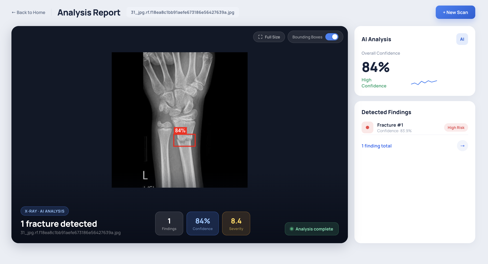
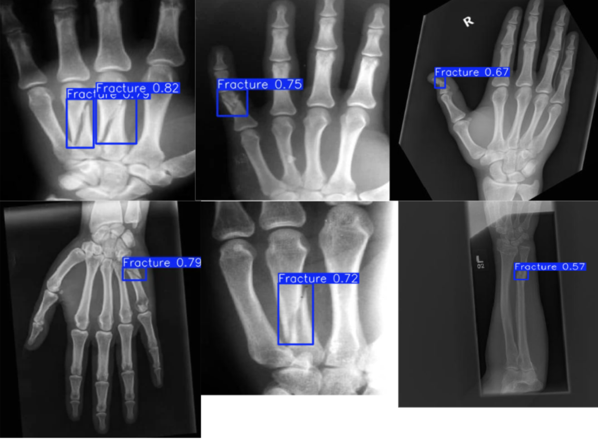

# X-Ray Fracture Detection

**Live demo:** https://x-ray-fracture-detection.vercel.app

> AI Integration · Computer Vision · ASP.NET Core · React

An AI-powered web application that detects bone fractures in X-ray images. Upload a scan, get instant results — bounding boxes drawn over detected fractures with confidence scores.



---

## Tech Stack

**Backend**
- ASP.NET Core Web API (.NET 10)
- Microsoft.ML.OnnxRuntime (in-process YOLOv8 inference — no Python in runtime)
- SixLabors.ImageSharp (cross-platform image preprocessing)
- Entity Framework Core 10 + PostgreSQL (Neon.tech)
- FluentValidation
- Docker / Azure Container Apps

**AI / Machine Learning**
- YOLOv8m (Ultralytics) — object detection
- Custom-trained on 1 036 annotated X-ray images
- Radiology-adapted augmentation strategy
- Transfer learning + fine-tuning on extended dataset
- Exported to ONNX format for cross-platform inference

**Frontend**
- React 19 + TypeScript
- Canvas API (bounding box rendering)
- Deployed on Vercel

---

## Features

- **Fracture detection** — upload a JPEG, PNG, or BMP X-ray (up to 20 MB); the YOLOv8 ONNX model runs inference in under 2 seconds and returns bounding boxes with confidence scores.
- **Bounding box overlay** — the frontend draws detected fracture regions directly on the image using the Canvas API; a toggle lets you show or hide the boxes.
- **Fullscreen viewer** — expand the annotated scan to fill the screen for a closer look.
- **Risk classification** — each detection is labelled High / Medium / Low Risk based on the model's confidence score.
- **Persistent history** — every analysis request is stored in PostgreSQL (image hash + file name + detections); retrieve past results by request ID via `GET /api/analysis/{id}`.
- **Health check** — `GET /health` verifies database connectivity and ONNX session availability.
- **API documentation** — Scalar UI available at `/scalar` in development.

---

## Architecture

The backend follows **Repository Pattern over 3-layer architecture** with four projects in one solution:

```
XRayFractureDetection.sln
├── Domain          — entities, enums, repository interfaces, IUnitOfWork
├── DataAccess      — EF Core DbContext, repository implementations, migrations
├── BusinessLogic   — services, DTOs, FluentValidation validators, mapping extensions
└── WebAPI          — controllers, ONNX inference, middleware, Program.cs
```

Dependency direction is strict — inner layers know nothing about outer ones:

```
Domain ← DataAccess
Domain ← BusinessLogic
BusinessLogic + DataAccess ← WebAPI
```

`IInferenceService` is defined in BusinessLogic; `OnnxInferenceService` lives in WebAPI. The business layer is fully testable without loading a real model or touching the database.

The image is **never written to disk** — it lives in a `MemoryStream` for the duration of one request and is then discarded. Only metadata is persisted: SHA-256 hash, file name, status, and detection results (relative bounding-box coordinates + confidence).

---

## ML Model

The YOLOv8m model was trained and evaluated through two rounds of experimentation before integration.

### Dataset

- **1 036 annotated X-ray images**, single class: `Fracture`
- Annotations in YOLO format (bounding boxes)
- Split: train / validation / test

### Training strategy — 2×2 experiment

To find the best training configuration, four variants were compared across two axes: weight initialisation (from scratch vs. transfer learning from `yolov8m.pt`) and augmentation strategy (none vs. radiology-adapted).

| Experiment | Precision | Recall | mAP50 | mAP50-95 |
|---|---|---|---|---|
| Scratch, no augmentation | 0.688 | 0.458 | 0.483 | 0.187 |
| Scratch + radiology augmentation | 0.858 | **0.760** | 0.745 | **0.321** |
| Transfer, no augmentation | 0.824 | 0.495 | 0.571 | 0.234 |
| Transfer + radiology augmentation | 0.835 | 0.703 | **0.752** | 0.318 |

Radiology-adapted augmentation had the largest positive effect — mAP50 improved by **+0.26** over the no-augmentation baseline. Standard colour/saturation augmentations were disabled (irrelevant for greyscale X-rays); moderate brightness, rotation, scale, horizontal flip, and limited mosaic were applied instead.

### Fine-tuning on an extended dataset

The initial model scored mAP50 = **0.794** on the original test set but only **0.094** on a new set of radiographs with different visual characteristics — confirming the need for further fine-tuning.

Six fine-tuning strategies were evaluated (varying the training-set composition and whether early backbone layers were frozen):

| Experiment | New test mAP50 | Old test mAP50 | Combined mAP50 |
|---|---|---|---|
| Baseline (no fine-tuning) | 0.094 | 0.794 | 0.643 |
| New data only | 0.708 | 0.205 | 0.296 |
| Mixed 50 / 50 | 0.656 | 0.762 | 0.737 |
| **Mixed 67 % old / 33 % new** | **0.695** | **0.786** | **0.762** |

Training only on new data achieved the highest new-set score but caused severe degradation on the original set. The best overall balance was reached with a **67 % old / 33 % new** mixture and a reduced learning rate of `0.0001` — mAP50 on the combined test set rose from 0.643 to **0.762** while the original-set score dropped by less than 0.01.

### Final model

The final model (`E5_mix_67old_33new_full`, best checkpoint) was exported to ONNX format (`imgsz=640`) and integrated directly into the .NET backend via `Microsoft.ML.OnnxRuntime`.




> **Disclaimer.** The model is integrated as an assistive tool only — it highlights suspicious regions for review. Final diagnosis remains with the radiologist.

---

## API

| Method | Path | Description |
|--------|------|-------------|
| `POST` | `/api/analysis/analyze` | Upload an X-ray image (`multipart/form-data`, field `image`, max 20 MB). Returns detections immediately. |
| `GET` | `/api/analysis/{requestId}` | Retrieve a stored result by its GUID. Returns `404` if not found. |
| `GET` | `/health` | Database + ONNX session health check. |

**Example response — `POST /api/analysis/analyze`**

```json
{
  "requestId": "3fa85f64-5717-4562-b3fc-2c963f66afa6",
  "status": 1,
  "createdAt": "2025-06-23T10:15:00Z",
  "detections": [
    {
      "isFracture": true,
      "confidence": 0.87,
      "x": 0.38,
      "y": 0.29,
      "width": 0.21,
      "height": 0.15
    }
  ]
}
```

Bounding-box coordinates are **relative** (0.0 – 1.0 of image dimensions). Multiply by canvas width/height to draw.

---

## Getting Started

### Prerequisites

- [.NET 10 SDK](https://dotnet.microsoft.com/download)
- PostgreSQL (local or cloud — see below)
- A trained YOLOv8 ONNX model exported with `model.export(format='onnx', imgsz=640)`

### 1. Clone the repository

```bash
git clone https://github.com/R3shotka/XRayFractureDetection.git
cd XRayFractureDetection/backend
```

### 2. Place the ONNX model

Copy your `.onnx` file to:

```
backend/XRayFractureDetection.WebAPI/Infrastructure/AI/Models/yolov8_fracture.onnx
```

### 3. Configure the database

Set up a PostgreSQL instance (local or [Neon.tech](https://neon.tech) — free tier works fine) and store the connection string using .NET user secrets so it is never committed to the repository:

```bash
cd XRayFractureDetection.WebAPI
dotnet user-secrets init
dotnet user-secrets set "ConnectionStrings:Default" \
  "Host=YOUR_HOST;Database=xray_db;Username=YOUR_USER;Password=YOUR_PASS;SSL Mode=Require;Trust Server Certificate=true"
```

### 4. Apply migrations

```bash
dotnet ef database update \
  --project ../XRayFractureDetection.DataAccess \
  --startup-project .
```

### 5. Run the backend

```bash
dotnet run --project XRayFractureDetection.WebAPI
```

Scalar API reference is available at `https://localhost:{port}/scalar`.

### 6. Run the frontend

```bash
cd ../../frontend
npm install
npm start        # http://localhost:3000
```

The frontend reads the backend URL from `REACT_APP_API_URL` (defaults to `http://localhost:5015`).

---

## Running with Docker

```bash
cd backend
docker build -t xray-api .
docker run -p 8080:8080 \
  -e "ConnectionStrings__Default=YOUR_CONNECTION_STRING" \
  xray-api
```

The container exposes port `8080`. The ONNX model must be present in the image at build time (it is copied from `WebAPI/Infrastructure/AI/Models/` during the Docker build).

---

## Running Tests

```bash
cd backend
dotnet test
```

Tests live in `XRayFractureDetection.Tests/` and cover:

- `AnalysisService` — inference result mapping, Failed status on model crash, SaveChanges called exactly once, null result on missing ID
- `MappingExtensions` — all fields mapped correctly from entity to DTO
- `AnalyzeImageRequestValidator` — valid request passes, empty file name fails

All tests use mocked dependencies (Moq) — no database or ONNX model required.

---

## Project Structure

```
backend/
├── XRayFractureDetection.Domain/
│   ├── Entities/           AnalysisRequest, DetectionResult
│   ├── Enums/              AnalysisStatus
│   └── Interfaces/         IAnalysisRequestRepository, IDetectionResultRepository, IUnitOfWork
│
├── XRayFractureDetection.DataAccess/
│   ├── Context/            AppDbContext, AppDbContextFactory
│   ├── Repositories/       AnalysisRequestRepository, DetectionResultRepository
│   ├── UnitOfWork.cs
│   └── Migrations/
│
├── XRayFractureDetection.BusinessLogic/
│   ├── DTOs/               Request and response DTOs
│   ├── Interfaces/         IAnalysisService, IInferenceService
│   ├── Services/           AnalysisService
│   ├── Validators/         AnalyzeImageRequestValidator (FluentValidation)
│   ├── Mapping/            MappingExtensions (manual, no libraries)
│   └── Exceptions/         ImageProcessingException
│
├── XRayFractureDetection.WebAPI/
│   ├── Controllers/        AnalysisController
│   ├── Infrastructure/AI/  OnnxInferenceService, ImagePreprocessor
│   ├── Middleware/         GlobalExceptionMiddleware (RFC 7807 ProblemDetails)
│   ├── Options/            OnnxOptions
│   └── Program.cs
│
└── XRayFractureDetection.Tests/
    ├── AnalysisServiceTests.cs
    ├── MappingExtensionsTests.cs
    └── ValidatorTests.cs

frontend/
├── src/
│   ├── pages/              HomePage, AnalysisPage
│   ├── components/         ResultCanvas (Canvas API bounding-box renderer)
│   ├── services/           analysisApi.ts
│   └── types/              analysis.ts
└── public/images/          sample X-ray images
```

---

## Key Technical Decisions

**ONNX in-process vs Python sidecar.** The YOLOv8 model runs directly inside the .NET process via `Microsoft.ML.OnnxRuntime`. No Python runtime, no inter-process communication, no extra container. `InferenceSession` is registered as a Singleton — loaded once at startup, reused across all requests (it is thread-safe).

**Letterbox preprocessing.** Resizing the input image to 640×640 with padding (not stretching) preserves aspect ratio. The model was trained on letterboxed images; distorting anatomy would reduce accuracy. `SixLabors.ImageSharp` is used instead of `System.Drawing` because `System.Drawing.Common` is not supported on Linux.

**Relative bounding-box coordinates.** The API returns coordinates as fractions of the image dimensions (0.0 – 1.0) rather than absolute pixels. The frontend multiplies by canvas size, so the overlay scales correctly regardless of display resolution.

**No image storage.** The uploaded file never touches the disk. It is buffered in a `MemoryStream` for hashing and inference, then discarded. Only the SHA-256 hash, file name, and detection metadata are persisted.

**Unit of Work.** Repositories only track changes in the EF Core change tracker; `SaveChangesAsync` is called once per business operation through `IUnitOfWork`. This ensures creating an `AnalysisRequest` and its `DetectionResult` rows is a single atomic transaction.

**Manual mapping.** There are exactly two entity-to-DTO mappings in the project. Using AutoMapper or Mapster would add reflection overhead and a hidden dependency for twenty lines of explicit, debuggable code.
